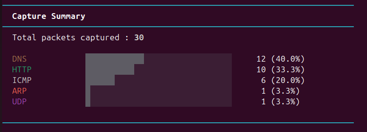

# CodeAlpha Network Sniffer — Task 1

CodeAlpha Cybersecurity Internship — Basic Network Sniffer
Author: LBIEN Bilal | github.com/b1l4l-sec

---

## Screenshot

---

## Overview

A production-quality Python network packet sniffer built with Scapy.
Captures, dissects, and displays live network traffic with deep protocol analysis across multiple OSI layers.

### Supported Protocols

| Layer | Protocols |
|-------|-----------|
| L2    | Ethernet, ARP |
| L3    | IP, IPv6, ICMP |
| L4    | TCP, UDP |
| L7    | HTTP, HTTPS/TLS, DNS, SSH, FTP, SMTP, RDP, SMB, NTP, and 20+ more |

---

## Features

- Multi-layer dissection: Ethernet -> IP -> TCP/UDP -> Application
- Protocol identification: 30+ services mapped by port
- TLS inspection: Detects ClientHello, ServerHello, Certificate handshakes
- DNS parsing: Queries and responses with resolved IPs
- HTTP analysis: Method, Host, Path for requests; status code for responses
- Cleartext warnings: Flags TELNET, FTP, and other insecure protocols
- ARP monitoring: Detect ARP requests/replies
- Colored terminal output: Protocol-specific color coding
- Live statistics: Per-protocol breakdown with progress bars on exit
- BPF filter support: Filter by protocol, port, host, etc.
- Interface selection: Sniff on any available interface

---

## Installation

    git clone https://github.com/b1l4l-sec/CodeAlpha.git
    cd CodeAlpha/CodeAlpha_NetworkSniffer
    pip3 install -r requirements.txt

---

## Usage

    # Sniff all traffic (requires root)
    sudo python3 sniffer.py

    # Specific interface
    sudo python3 sniffer.py -i enp0s3

    # Capture 100 packets then stop
    sudo python3 sniffer.py -c 100

    # BPF filter — TCP only
    sudo python3 sniffer.py -f "tcp"

    # DNS traffic only
    sudo python3 sniffer.py -f "udp port 53"

    # HTTP and HTTPS
    sudo python3 sniffer.py -f "tcp port 80 or tcp port 443"

    # List available interfaces
    sudo python3 sniffer.py --list-interfaces

    # Combine options
    sudo python3 sniffer.py -i enp0s3 -c 200 -f "tcp"

---

## Project Structure

    CodeAlpha_NetworkSniffer/
    |-- sniffer.py          # Entry point: CLI args, sniff loop, signal handler
    |-- packet_analyzer.py  # Deep packet dissection (all protocol layers)
    |-- display.py          # Colored terminal output and summary stats
    |-- requirements.txt    # Python dependencies
    |-- screenshot.png      # Sample output screenshot
    |-- README.md

---

## Legal Notice

This tool is developed strictly for educational purposes as part of the CodeAlpha Cybersecurity Internship.
Only use it on networks you own or have explicit permission to monitor.
Unauthorized packet sniffing is illegal in most jurisdictions.

---

## Technologies

- Python 3
- Scapy — Packet capture and protocol dissection
- Colorama — Cross-platform terminal colors
- argparse — CLI interface

---

## About

LBIEN Bilal — 2nd year Engineering student (GDNC), ENSA Fes
Specialization: Cybersecurity, Network Security, Secure Development
- MACC26 — 1st regional rank Fes-Meknes, 14th national
- Club SECOPS Tech Lead, ENSA Fes

---

Part of CodeAlpha Cybersecurity Internship — Task 1: Basic Network Sniffer
